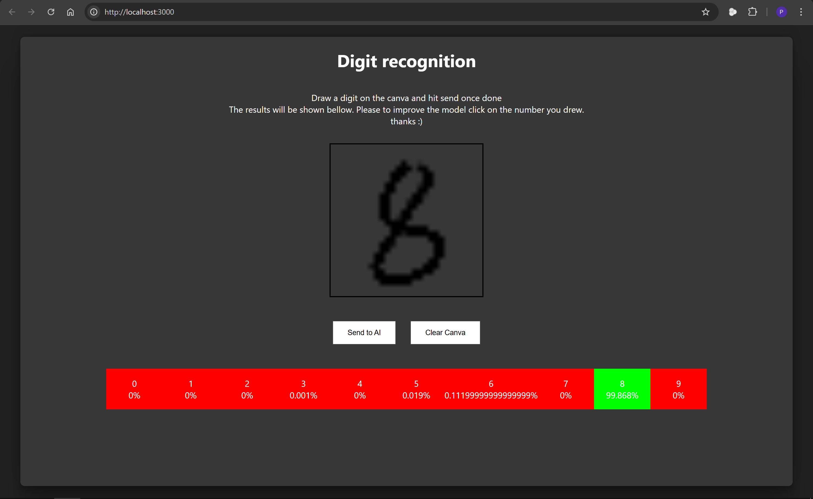

# Digits-recon

Digits recon is a very small and simple application using react on the front end and flask in conjection with tensorflow on the backend to do a digit recognition of what you draw on the screen. 

The model is not perfect but the goal of this project is to show my skills and capabilities regarding these technologies.

## Overview
